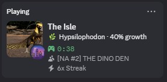
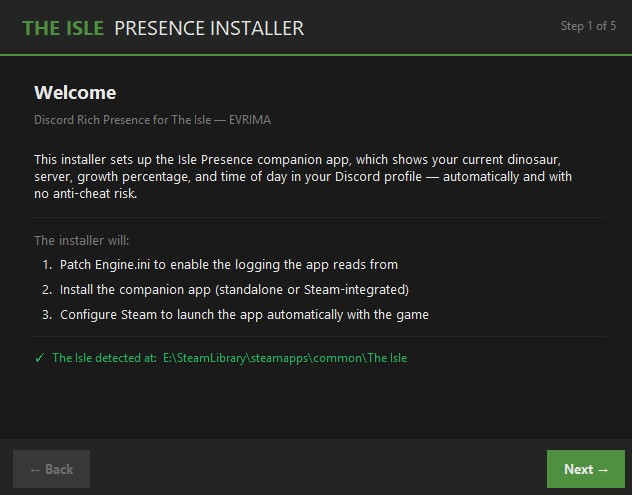
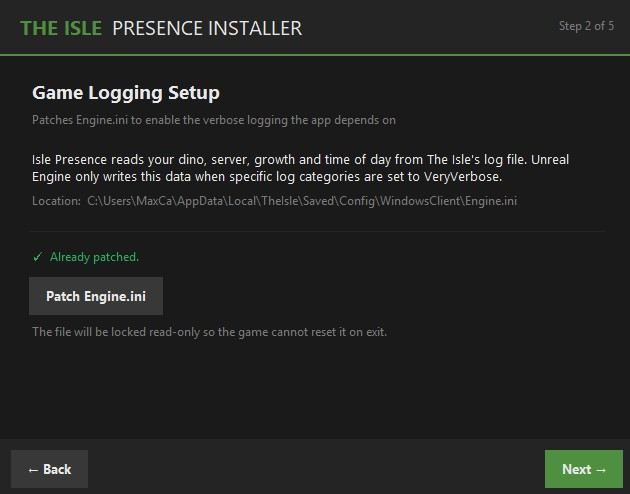
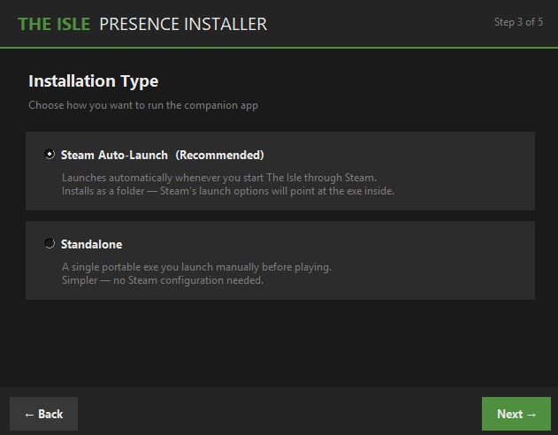
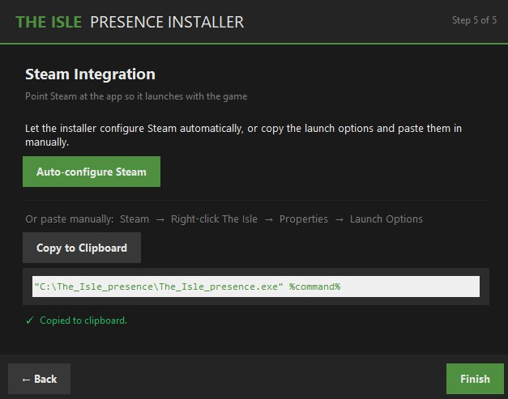
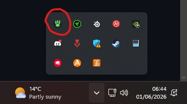

# 🦕 The Isle Presence

### Discord Rich Presence companion for **The Isle — EVRIMA**


Automatically displays your current dinosaur, server, growth stage, and time of day in your Discord profile — with no memory reading, no anti-cheat risk, and no game file modifications.

---

## Preview



---

## Features

- 🦕 **Dinosaur species** — detected automatically at spawn
- 📈 **Growth percentage** — updated every autosave, shows `Elder` at cap
- 🥩🌿🍖 **Diet indicator** — carnivore, herbivore, or omnivore emoji
- 🌙 **Time of day** — shown as a small icon (morning / afternoon / evening / night)
- 🖥️ **Server name** — trimmed cleanly to just the server's actual name
- ⏱️ **Elapsed timer** — resets on each new life
- 🔇 **Runs silently** — lives in your system tray, no console window
- 🎮 **Steam integration** — launches automatically with the game, closes when you quit

---

## How It Works

The Isle Presence reads The Isle's log file in real time — no memory reading, no DLL injection, and nothing that EasyAntiCheat can object to. A small tweak to `Engine.ini` enables the verbose logging the app depends on, which the installer handles automatically.

---

## Installation

1. Download `The_Isle_presence_installer.exe` from the [latest release](../../releases/latest)
2. Run it and follow the steps — the installer will:
   - Patch your `Engine.ini` to enable the logging the app reads from
   - Install the companion app
   - Configure Steam to launch the app automatically with the game

That's it. No manual configuration required.

> ⚠️ **Do not install inside The Isle's game folder.** EasyAntiCheat monitors processes launched from the game directory. Install anywhere else — the default (`C:\The_Isle_presence`) is fine.






---

## Installer Options

During installation you'll be asked to choose between two versions:

| Version | Description |
|---|---|
| **Steam Auto-Launch** *(recommended)* | Launches automatically when you start The Isle through Steam. Closes when the game exits. |
| **Standalone** | A single exe you launch manually before playing. No Steam configuration needed. |

---

## Usage

Once running, the app lives silently in your system tray.



Right-click the tray icon for options:

| Option | Description |
|---|---|
| Show Console | Opens the log output window for debugging |
| Hide Console | Hides the console window |
| Exit | Closes the app |

### When does it update?

| Event | What updates |
|---|---|
| Joining a server | Dino species, server name |
| Spawning in | Elapsed timer starts |
| Every ~2 minutes (autosave) | Growth, health, hunger, thirst |
| Safe-logging out | Final stats |
| Periodically in-game | Time of day |

---

## Presence Layout

```
[Dino portrait]   The Isle
      [🌙]        🥩 Troodon  ·  36% growth
                  ⏱ 1:46
                  👥 Petits Pieds EU
```

---

## Anti-Cheat

The Isle uses **EasyAntiCheat**. This app is safe because it:

- ✅ Only reads the game's log file — no process memory access
- ✅ Makes no game file modifications
- ✅ Does not inject code or DLLs into the game process
- ✅ Must not be run from inside the game's directory (the installer enforces this)

---

## Troubleshooting

**Presence shows "In menus" even in-game**
- Check the console (right-click tray → Show Console) for errors
- Make sure the Engine.ini patch was applied — re-run the installer if unsure

**Dino not detected**
- The dino is detected at the moment of spawn via the game log
- If you launched the app after already being in-game, rejoin the server

**Growth not showing**
- Growth only appears after the first autosave (~2 minutes after spawning)

**Server name missing or wrong**
- Some servers format their names differently — open an issue with your server name and we'll add support

**Steam isn't auto-launching the app**
- Verify the path in Steam launch options matches exactly where you installed
- Make sure you installed the Steam Auto-Launch version, not the Standalone version

---

## Building from Source

```bash
git clone https://github.com/yourusername/the-isle-presence
cd the-isle-presence
pip install -r requirements.txt
python The_Isle_presence.py
```

Releases are built automatically via GitHub Actions. To build locally:

```bash
pip install pyinstaller

# Standalone
pyinstaller --onefile --noconsole --icon=assets/dino_foot_icon.ico --name The_Isle_presence The_Isle_presence.py

# Steam auto-launch
pyinstaller --onedir --noconsole --icon=assets/dino_foot_icon.ico --name The_Isle_presence The_Isle_presence.py
```

---

## Contributing

Pull requests welcome. If you find a new log pattern that exposes useful data, open an issue with a sample log snippet and we'll add support.

---

## License

MIT — do whatever you want with it.

---

*Not affiliated with Afterthought LLC or The Isle development team.*
